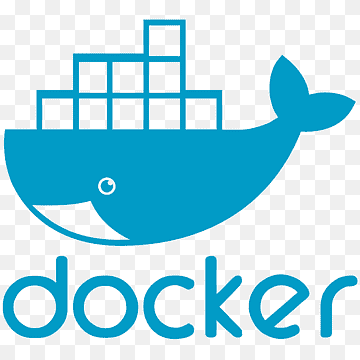

## Hey 👋, I'm [Duy Nguyen!](https://github.com/iampavangandhi/)

### Glad to see you here! &nbsp; 

I'm a graduate in Software Engineering 🎓 from VNUHCM - University Of Science 🏛. I'm a passionate learner who's always willing to learn and work across technologies and domains 💡. I love to explore new technologies and leverage them to solve real-life problems ✨.  I'm currently into Web Development 🕸️ and working on my Data Structures and Algorithms 🤓. After more than 3 years working as a backend developer, I have grown valuable experience in designing server-side
applications with NodeJS/NestJS, ExpressJS, GraphQL, Solidity, funC and other tech stacks. My true passion lies in blockchain development, specifically in smart contracts. I have hands-on experience working with EVM (Solidity), TON (funC). I am dedicated to building secure, efficient, and innovative smart contracts to drive the future of decentralized applications.

Like My Work?

### Talking about Personal Stuffs:

- 🛠 &nbsp; I’m currently working with Nodejs, NestJs, Express,   GraphQL, Mongodb, PostgresSQL, Javascript, Typescript, Solidity, funC etc.
- 🚀 &nbsp; I’m currently learning Back End Development and Blockchain Development.
- 👨🏻‍💻 &nbsp; Most of my projects are available on [Github](https://github.com/huuduynvc).
- 👾 &nbsp; Fun fact: Equal is Not Always Equal in Javascript.
- 📫 &nbsp; How to reach me: nguyenhuuduynvc@gmail.com.
- 📝 &nbsp; Checkout my [Resume](https://github.com/huuduynvc/huuduynvc/blob/master/resume.pdf). (OUT OF DATE)

### My Absolute Favorites:

- 💻 &nbsp; I love exploring new tech stack and building cool stuffs.
- 📰 &nbsp; Reading & writing tech blogs whenever possible.
- 🍕 &nbsp; Hackathons, meetups & tech events.

### Languages and Tools:

<!-- <code></code>
<code></code> -->

<code></code>
<code></code>
<code></code>
<code></code>
<code></code>
<code></code>
<code></code>
<code></code>
<code></code>
<code></code>
<code></code>
<code></code>

<!--
<code></code>
-->

### Projects Stuffs:

<!-- 

  
<b>⚡ Github Stats</b>

   
  
  

  
<b>☄️ Github Streaks</b>

   
  

 -->

  
<b>🧑‍🚀 Projects</b>

   
  <table>
    <thead align="center">
      <tr border: none;>
        <td><b>💻 Project</b></td>
        <td><b>🌟 Link</b></td>
        <td><b>🐛 Commits</b></td>
        <td><b>🔔 Pull Requests</b></td>
        <td><b>👨‍💻 Technologies</b></td>
      </tr>
    </thead>
    <tbody>
      <tr>
	      <td><a href="https://github.com/warenaofficial"><b>🚀 Warena</b></a></td>
        <td><a>https://warena.io</a></td>
        <td>🐛 100+</td>
        <td>🔔 50+</td>
        <td>NodeJS/NestJS, GraphQL, MongoDB</td>
      </tr>
      <tr>
	      <td><a href="https://github.com/ez-wallet"><b>💸 EZ Wallet</b></a></td>
        <td><a>https://ezwallet.xyz</a></td>
        <td>🐛 100+</td>
        <td>🔔 50+</td>
        <td>NodeJS/NestJS, PostgresSQL, Redis, Websocket</td>
      </tr>
      <tr>
	      <td><a href="https://github.com/heydevs-io"><b>👨🏻‍💻 Heydevs</b></a></td>
        <td><a>https://heydevs.io</a></td>
        <td>🐛 100+</td>
        <td>🔔 50+</td>
        <td>NodeJS/NestJS, GraphQL, PostgresSQL, Redis, Websocket</td> 
      </tr>
    </tbody>
  </table>
   

 
<!-- 
	
   
  
<b>⚙️ Things I use to get stuff done</b>

  	<ul>
  	    <li><b>OS:</b> Ubuntu 20.04</li>
	    <li><b>Laptop: </b> HP Elitebook (i5)</li>
  	    <li><b>Browser: </b> Firefox Web Browser</li>
	    <li><b>Terminal: </b> ZSH: Oh My Zsh (PowerLevel10k)</li>
	    <li><b>Code Editor:</b> VSCode - The best editor out there.</li>
	    <li><b>To Stay Updated:</b> Dev.to, Medium, Linkedin and Twitter.</li>
	     
	⚛️ Checkout My VSCode Configrations <a href="https://gist.github.com/iampavangandhi/039b1dc5a7cdcb007ab3691814d53130">Here</a>.
	</ul>	

 -->

#

### Show some ❤️ by starring some of the repositories!

